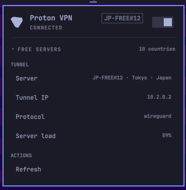

# Proton VPN Omarchy bar widget

Status and one-click fastest-server connection for Proton VPN in the menu bar.



## Features

- Bar icon: theme-colored Proton VPN mark with connected/disconnected state.
- Details panel with:
  - Connected server and location
  - Server load and protocol
  - Session uptime ("Connected for 2h 13m")
  - Tunnel IP
  - Collapsible list of free-server countries (click the header or press `s`)
  - Refresh action
- Desktop notifications when the VPN connects, disconnects, or a command fails
  (goes through the shell's notification daemon, so do-not-disturb applies).
- Left click opens the panel.
- Right click connects to the fastest eligible Proton server or disconnects.
- Middle click refreshes status.
- Keyboard navigation: `j`/`k`, `enter`, `t`, `c`, `s`, `r`, and `esc`.

## Backend

This plugin uses Proton's official Linux CLI. It does not use `wg-quick`,
static WireGuard files, downloaded server configs, or custom DNS commands.

```bash
protonvpn connect       # fastest eligible server
protonvpn disconnect
protonvpn status
```

The official CLI performs server selection, NetworkManager setup, DNS, and
firewall handling. On a Free plan, Proton selects the fastest available free
server. The GUI and CLI cannot run simultaneously; close `protonvpn-app`
before using the bar toggle with this backend.

## Requirements

- `proton-vpn-cli` installed and signed in
- `wl-copy` for copy actions
- `notify-send` for desktop notifications (disable with the
  `notificationsEnabled` setting if it is not installed)

Install the official Arch package with:

```bash
omarchy pkg add proton-vpn-cli
protonvpn signin
```

## Setup

```bash
ln -s "$(pwd)" ~/.config/omarchy/plugins/tharin.protonvpn
omarchy plugin enable tharin.protonvpn
omarchy bar move tharin.protonvpn --section right
```

The shell hot-reloads changes. Force discovery if needed:

```bash
omarchy-shell shell rescanPlugins
```

## Settings

| Key                  | Type    | Default | Meaning                        |
|----------------------|---------|---------|--------------------------------|
| `refreshIntervalSec` | integer | 30      | CLI status poll interval       |
| `notificationsEnabled` | boolean | true  | Desktop notifications on connect/disconnect/failure |

Set it with:

```bash
omarchy bar set tharin.protonvpn refreshIntervalSec 30
```

## Removal

```bash
omarchy plugin disable tharin.protonvpn
rm ~/.config/omarchy/plugins/tharin.protonvpn   # symlink or copied folder
```

To also uninstall the CLI dependency:

```bash
omarchy pkg drop proton-vpn-cli
```
